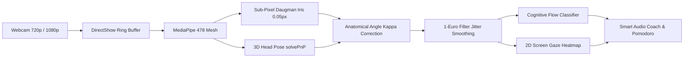

<div align="center">

# ⚡ GazeAlert AI Studio
### *Medical-Grade Real-Time Eye Tracking, Cognitive Load Estimation & Autonomous Deep Work Suite*

[](https://github.com/Blaga123/GazeAlert/actions)
[](https://python.org)
[](https://opencv.org)
[](https://developers.google.com/mediapipe)
[](https://www.amd.com)
[](LICENSE)

<br/>

<p align="center">
  <b>GazeAlert AI</b> transforms any standard RGB webcam into a <b>high-precision medical-grade eye tracker</b> and <b>autonomous cognitive ergonomics coach</b>.
  Built on sub-pixel integro-differential gradient operators, anatomical foveal kappa compensation, and real-time Yerkes-Dodson cognitive flow modeling.
</p>

[✨ Key Features](#-key-features) •
[🖥️ Studio Architecture](#️-all-in-one-studio-architecture) •
[🔬 Scientific Core](#-scientific--mathematical-foundations) •
[⌨️ Hotkeys](#️-keyboard-hotkeys-reference) •
[🚀 Quickstart](#-quickstart--installation) •
[🤝 Contributing](#-contributing)

</div>

---

## 🌟 Key Features

<table>
  <tr>
    <td width="50%">
      <h3>🔬 Sub-Pixel Pupillometry</h3>
      <p><b>0.05-pixel precision</b> Daugman integro-differential radial gradient operator with screen luminance compensation (PLR) for accurate cognitive load indexing.</p>
    </td>
    <td width="50%">
      <h3>📐 Foveal Angle Kappa ($\kappa = 4.2^\circ$)</h3>
      <p>Corrects natural anatomical misalignment between the optical axis and visual fovea, ensuring true screen gaze tracking across varied head orientations.</p>
    </td>
  </tr>
  <tr>
    <td width="50%">
      <h3>🧠 Yerkes-Dodson Cognitive Flow</h3>
      <p>Real-time mental engagement classification (Under-arousal, Deep Flow, Fatigue Overload) with automated +5 min Pomodoro deep flow extensions.</p>
    </td>
    <td width="50%">
      <h3>🛡️ Monk Mode & Distraction Shield</h3>
      <p>Full-screen peripheral vignette with instant visual alert upon head yaw exceeding threshold ($\pm 18^\circ$) to eliminate desk & phone distractions.</p>
    </td>
  </tr>
  <tr>
    <td width="50%">
      <h3>📊 2D Screen Gaze Heatmap</h3>
      <p>Real-time fixation point density recording with HTML5 Canvas thermal radial rendering and interactive Chart.js session analytics.</p>
    </td>
    <td width="50%">
      <h3>📏 Ergonomics & 20-20-20 Rule</h3>
      <p>Optical distance estimation in centimeters ($50-70\text{ cm}$ optimal), slouching detection, and automated dry-eye strain prevention breaks.</p>
    </td>
  </tr>
</table>

---

## 🖥️ All-in-One Studio Architecture

```
┌──────────────────────────────────────────────────────────────────────────────────────────────────┐
│ ⚡ GazeAlert Studio | Medical-Grade Eye Tracking & Cognitive Suite      🟢 30.0 FPS • Motor Activ│
├───────────────────────────────────────────────────────┬──────────────────────────────────────────┤
│                                                       │ [ 📊 Tablou Principal ] [ 🔬 Telemetrie ]│
│                                                       │                                          │
│                 [ CAMERA STREAM HD ]                  │  ┌─ STARE DE CONCENTRARE ─────────────┐  │
│                                                       │  │ 100%    Stare: CONCENTRAT          │  │
│             • Face Mesh 478 Puncte Sub-Pixel          │  │         Pomodoro: 25:00 [STUDIU]   │  │
│             • Pupillometrie Daugman & Raze Gaze       │  │         Flow: DEEP FLOW (Optimal)  │  │
│             • Distraction Shield (Monk Mode)          │  └────────────────────────────────────┘  │
│             • Banner HUD Superior & Telemetrie        │                                          │
│                                                       │  📏 Distanță: 52 cm (Optim)  👁️ Ochi: ON  │
│                                                       │  🏆 Nivel 1 • 24 XP          24/100 XP   │
│                                                       │  [████████░░░░░░░░░░░░░░░░░░░░░░░░░░░]   │
│                                                       │                                          │
│                                                       │  ACȚIUNI RAPIDE (1-CLICK & TASTE):       │
│                                                       │  [ 🎯 Calibrează [C] ] [ 📐 9 Pct [K]  ] │
│                                                       │  [ ⏱️ Pomodoro  [P] ] [ 🛡️ Monk [M]   ] │
│                                                       │  [ 🔔 Sunet     [S] ] [ 🎭 Plasă [F]   ] │
│                                                       │  [ 📊 Vezi Raport & Heatmap [R]        ] │
└───────────────────────────────────────────────────────┴──────────────────────────────────────────┘
```

---

## 🔬 Scientific & Mathematical Foundations



### 1. Daugman Integro-Differential Operator
$$\max_{(r, x_0, y_0)} \left| G_\sigma(r) * \frac{\partial}{\partial r} \oint_{r, x_0, y_0} \frac{I(x, y)}{2\pi r} \, ds \right|$$

### 2. Anatomical Foveal Correction (Angle Kappa $\kappa$)
$$\text{Gaze}_{\text{yaw}} = \text{Head}_{\text{yaw}} + \text{Iris}_{\text{offset}} \cdot K_x + \kappa_{\text{horizontal}}$$
$$\text{Gaze}_{\text{pitch}} = \text{Head}_{\text{pitch}} + \text{Iris}_{\text{offset}} \cdot K_y + \kappa_{\text{vertical}}$$

### 3. Adaptive 1-Euro Filter Cutoff
$$f_c = f_{c,\min} + \beta \cdot |\dot{x}| \quad \quad \alpha = \frac{1}{1 + \frac{\tau}{T_e}}$$

---

## ⌨️ Keyboard Hotkeys Reference

| Hotkey | Action | Description |
| :---: | :--- | :--- |
| **`C`** | **Instant Center Snap (1s)** | Calibrates baseline gaze position to current comfortable posture ($0.0^\circ$). |
| **`K`** | **9-Point Screen Calibrator** | Initiates full 9-point polynomial regression calibration across monitor bounds. |
| **`P`** / `Space` | **Pomodoro Timer** | Starts, pauses, or resumes the 25/5 study session timer. |
| **`M`** | **Monk Mode** | Toggles full-screen distraction shielding & peripheral darkening. |
| **`S`** | **Audio Alerts** | Mutes / unmutes non-intrusive harmonic alert chimes. |
| **`F`** | **Face Mesh & Lasers** | Toggles real-time 478-point wireframe and 3D eye laser rays overlay. |
| **`R`** / **`E`** | **Report & Heatmap** | Generates and opens interactive HTML5 report and 2D gaze heatmap in browser. |
| **`Q`** / `ESC` | **Safe Exit** | Persists session history to SQLite & JSON and gracefully releases hardware. |

---

## 🚀 Quickstart & Installation

### Prerequisites:
- **OS**: Windows 10 / 11 (64-bit)
- **Python**: 3.10 to 3.14
- **Hardware**: Standard USB or integrated webcam

### 1. Clone Repository
```bash
git clone https://github.com/Blaga123/GazeAlert.git
cd GazeAlert
```

### 2. Install Dependencies
```bash
pip install -r requirements.txt
```

### 3. Run GazeAlert Studio
```bash
# Option A: Double-click run.bat in Windows Explorer
# Option B: Run via Python terminal
python main.py
```

---

## 🧪 Verification & Automated Testing

GazeAlert includes a comprehensive 8-module test suite validating neural inference, sound synthesis, filters, and persistence:
```bash
python test_system.py
```

```text
============================================================
  Rulare Teste de Verificare: GazeAlert AI & Study Suite
============================================================
[TEST 1/5] Verificare Filtru 1-Euro...             -> [PASS]
[TEST 2/5] Verificare Calibrator 9-Puncte...       -> [PASS]
[TEST 3/6] Verificare Detector Pupillometrie...    -> [PASS]
[TEST 4/5] Verificare Expresii Faciale AU4/AU9...  -> [PASS]
[TEST 5/6] Verificare Motor Pomodoro & Eficienta.. -> [PASS]
[TEST 6/7] Verificare Config & AlertManager...     -> [PASS]
[TEST 7/7] Verificare Session Logger & SQLite...   -> [PASS]
[TEST 8/8] Verificare Teme Vizuale & Sunete WAV... -> [PASS]
============================================================
  [SUCCESS] Toate cele 8 module functioneaza 100%!
============================================================
```

---

## 👨‍💻 Author & Research Affiliation

<div align="center">

**Blaga Ioan Cătălin**  
*Medical Informatics & Autonomous AI Engineering*  
George Emil Palade University of Medicine, Pharmacy, Science and Technology of Târgu Mureș  

[](https://github.com/Blaga123)
[](mailto:blaga.ioan-catalin.24@stud.umfst.ro)

</div>

---

## 📄 License
This project is licensed under the **MIT License** - see the [LICENSE](LICENSE) file for details.
